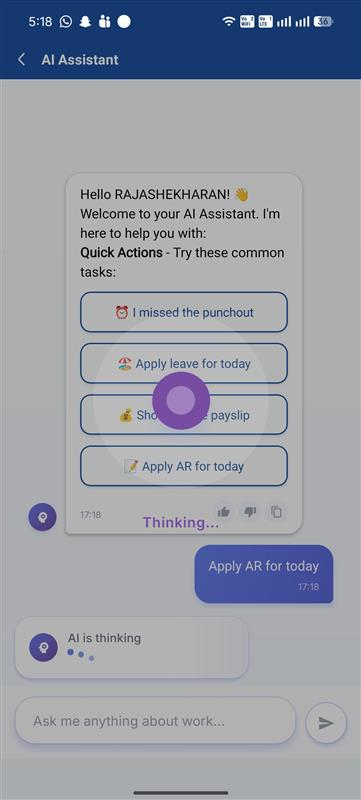
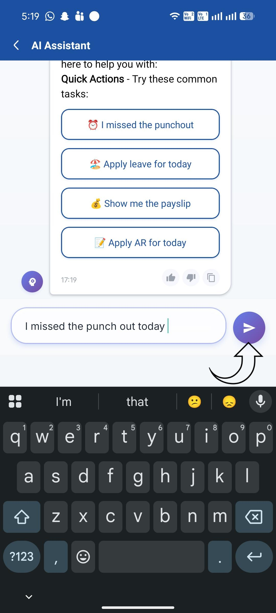
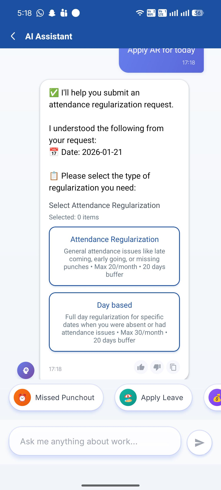
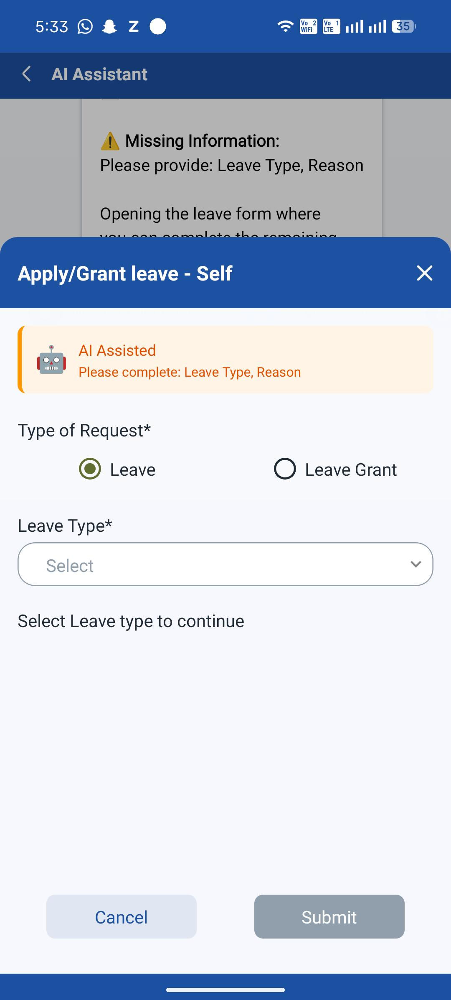
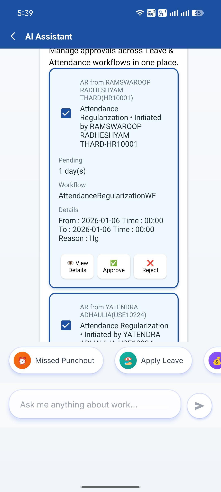
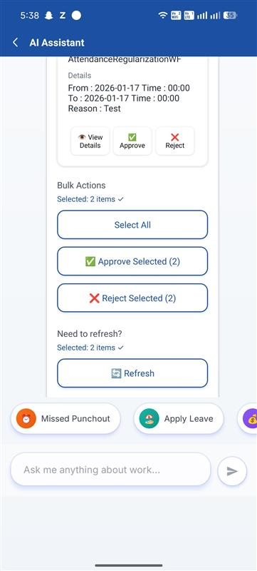
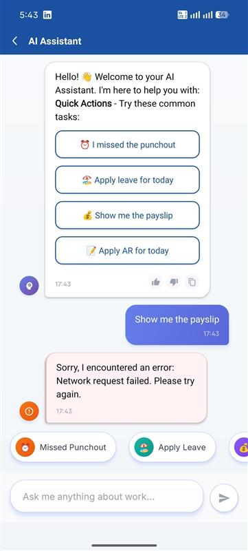

# AI Chat Bot – User & Support Guide

---

## Document Information

| Field | Details |
|-------|---------|
| Document Type | Client & Support Documentation |
| Last Updated | January 2026 |
| Audience | End Users, Support Teams, Implementation Consultants |

---

## Table of Contents

1. [Overview of the AI Chat Bot](#1-overview-of-the-ai-chat-bot)
2. [What Problems the AI Chat Bot Solves](#2-what-problems-the-ai-chat-bot-solves)
3. [How Users Access the AI Chat Bot](#3-how-users-access-the-ai-chat-bot)
4. [How Conversations Work](#4-how-conversations-work)
5. [What the AI Chat Bot Can Help With](#5-what-the-ai-chat-bot-can-help-with)
6. [What the AI Chat Bot Cannot Do](#6-what-the-ai-chat-bot-cannot-do)
7. [Common User Scenarios](#7-common-user-scenarios)
8. [Error & Fallback Scenarios](#8-error--fallback-scenarios)
9. [User Expectations & Best Practices](#9-user-expectations--best-practices)
10. [Data Privacy & User Safety](#10-data-privacy--user-safety)
11. [Support Team Guidance](#11-support-team-guidance)
12. [Known Limitations](#12-known-limitations)
13. [Frequently Asked Questions (FAQ)](#13-frequently-asked-questions-faq)

---

## 1. Overview of the AI Chat Bot

The **AI Chat Bot** (also called "AI Assistant") is a helpful virtual assistant built into the mobile app. It allows employees to complete everyday HR tasks simply by typing or speaking naturally, just like chatting with a helpful colleague.

Instead of navigating through multiple screens and menus, users can simply tell the AI Assistant what they need, and it will guide them through the process or complete the task directly.

### Key Highlights

- 💬 **Conversational Interface** – Type naturally like you're texting a friend
- ⚡ **Quick Actions** – Pre-built buttons for common tasks
- 📋 **Smart Forms** – Opens the right form with information already filled in
- 📄 **Document Downloads** – Get your payslips and documents easily

---

## 2. What Problems the AI Chat Bot Solves

### Before the AI Chat Bot

| Task | User Had to... |
|------|----------------|
| Apply for leave | Navigate to  Leave → Apply Leave → Fill form manually |
| Fix a missed punch | Find AR section → Select date → Choose type → Submit |
| Download payslip | Go to Payroll → Payslip → Find month → Download |
| Check attendance | Open Attendance → View summary → Count manually |

### With the AI Chat Bot

| Task | User Simply Says... |
|------|---------------------|
| Apply for leave | "I need a day off tomorrow" |
| Fix a missed punch | "I forgot to punch out yesterday" |
| Download payslip | "Show me my payslip" |
| Check leave | "How many leaves do I have?" |

**The AI Chat Bot saves time and reduces confusion by understanding what you need and handling the details for you.**

---

## 3. How Users Access the AI Chat Bot

### Finding the AI Assistant

The AI Chat Bot can be accessed from the main navigation or home screen of the app. Look for:

- An **"AI Assistant"** option in the menu
- A **chat bubble icon** on the home screen
- A **quick access button** in the bottom navigation

### First Look

When you open the AI Chat Bot for the first time:

1. You'll see a friendly **welcome message**
2. The assistant introduces itself and explains how it can help
3. **Quick action buttons** appear for common tasks:
   - ⏰ "I missed the punchout"
   - 🏖️ "Apply leave for today"
   - 💰 "Show me the payslip"
   - 📝 "Apply AR for today"

Simply tap any button to get started, or type your own question!

---

## 4. How Conversations Work

### Starting a Conversation

**Option 1: Tap a Quick Action Button**
- Buttons for common tasks appear on screen
- Simply tap one to start

**Option 2: Type Your Request**
- Tap the text input field at the bottom
- Type what you need in plain language
- Tap the send button (arrow icon)

---

### Asking Questions

You can ask questions naturally, just like talking to a person:

✅ **Good examples:**
- "I want to take leave tomorrow"
- "Can you show me my attendance for this month?"
- "I need to apply AR for yesterday"
- "Download my December payslip"

The AI Assistant understands everyday language – you don't need to use special commands or exact phrases.

---

### Receiving Answers

The AI Assistant responds in several ways:

**1. Text Responses**
- Explanations and guidance appear as chat messages
- Important information is highlighted in **bold**

**2. Interactive Buttons**
- When choices are needed, buttons appear
- Simply tap the option you want

**3. Forms**
- For tasks like applying leave, a form opens
- Information is pre-filled based on your request
- Just complete any remaining fields and submit

**4. Download Options**
- For documents like payslips, a download button appears
- Tap to save the file to your device

---

### Ending a Conversation

There's no formal "end" to a conversation. You can:

- Simply navigate away from the chat screen
- Come back anytime and start fresh
- Your current conversation stays until you leave the screen

**Note:** Conversations are not saved when you close the app. Each time you open the AI Chat Bot, it starts fresh.

---

## 5. What the AI Chat Bot Can Help With

### ✅ Leave Management

| You Can Say... | What Happens |
|----------------|--------------|
| "Apply leave for tomorrow" | Opens leave form with tomorrow's date |
| "I need casual leave from Monday to Wednesday" | Opens leave form with dates pre-filled |
| "How many sick leaves do I have?" | Shows your leave balance |
| "Check my pending leave requests" | Displays pending requests |

### ✅ Attendance & Regularization

| You Can Say... | What Happens |
|----------------|--------------|
| "I missed my punch out yesterday" | Guides you through AR process |
| "Apply AR for last Monday" | Opens AR form for that date |
| "I worked from home yesterday" | Shows WFH regularization options |
| "Show my attendance summary" | Displays attendance statistics |

### ✅ Payroll & Documents

| You Can Say... | What Happens |
|----------------|--------------|
| "Show me my payslip" | Provides download for latest payslip |
| "Download January payslip" | Provides download for specified month |
| "Get my salary slip" | Same as payslip request |

### ✅ Check-In / Check-Out (Punch)

| You Can Say... | What Happens |
|----------------|--------------|
| "Punch in" | Opens the attendance punch screen |
| "I want to check in" | Opens punch-in feature |
| "Clock out" | Opens punch-out feature |

### ✅ Approvals (For Managers)

| You Can Say... | What Happens |
|----------------|--------------|
| "Show pending approvals" | Lists requests waiting for your approval |
| "Approve leave requests" | Displays selectable leave requests |

Managers can select multiple requests and approve or reject them at once.

---

## 6. What the AI Chat Bot Cannot Do

The AI Assistant is designed to help with common HR tasks. Here's what it **cannot** do:

### ❌ Not Supported

| Request | Why Not Available |
|---------|-------------------|
| Change your personal information (address, bank details) | Requires HR verification |
| Submit expense claims | Uses a different process |
| Book meeting rooms or resources | Not an HR function |
| Answer company policy questions in detail | Policies vary; check HR portal |
| Talk to a human agent | No live chat transfer available |
| Remember previous conversations | Each session starts fresh |
| Work without internet | Requires connection to provide full help |

### What to Do Instead

If the AI Assistant can't help with something:
1. It will let you know politely
2. Navigate to the appropriate section in the app manually
3. Contact your HR team directly for complex requests

---

## 7. Common User Scenarios

### Scenario 1: Applying for Leave Tomorrow

**User:** "I need to take leave tomorrow"

**What Happens:**
1. AI understands the request
2. Opens the leave application form
3. Tomorrow's date is already filled in
4. User selects leave type, adds reason, and submits

**Result:** Leave request submitted successfully ✅

---

### Scenario 2: Forgot to Punch Out

**User:** "I forgot to punch out yesterday"

**What Happens:**
1. AI recognizes this as an attendance issue
2. Shows options: "Missed Punch Out", "Work From Home", etc.
3. User taps "Missed Punch Out"
4. AR form opens with yesterday's date
5. User adds reason and submits

**Result:** Attendance regularization submitted ✅

---

### Scenario 3: Downloading a Payslip

**User:** "Show me my payslip"

**What Happens:**
1. AI fetches the latest available payslip
2. Shows document name and download button
3. User taps "Download"
4. File saves to device (Downloads folder on Android, Files on iOS)
5. On iOS, the document opens for preview

**Result:** Payslip downloaded successfully ✅

---

### Scenario 4: Manager Approving Multiple Requests

**User:** "Show pending approvals"

**What Happens:**
1. AI displays list of pending requests
2. Each request shows employee name, dates, type
3. Manager taps checkboxes to select multiple items
4. Taps "Approve Selected" button
5. Confirms the action
6. All selected requests are approved

**Result:** Bulk approval completed ✅

---

## 8. Error & Fallback Scenarios

Sometimes things don't go as expected. Here's what users might see and what it means:

### Situation 1: "Offline Mode – Limited Responses"

**What the user sees:**
A banner showing "Offline Mode – Limited Responses"

**What it means:**
The AI service isn't reachable right now. The assistant will try to help with general guidance but can't complete actions.

**What to do:**
- Check your internet connection
- Tap the refresh/retry button
- Try again in a few minutes
- Use the regular app navigation as a backup

---

### Situation 2: "I'm having trouble connecting..."

**What the user sees:**
Message: "I'm having trouble connecting to the AI service. Please check your internet connection and try again."

**What it means:**
There's a temporary connection issue.

**What to do:**
- Ensure you have a stable internet connection
- Close and reopen the AI Chat Bot
- If the problem continues, try again later

---

### Situation 3: AI Doesn't Understand

**What the user sees:**
A response that doesn't match what was asked, or a generic "Could you tell me more?" reply.

**What it means:**
The AI couldn't determine what you needed.

**What to do:**
- Try rephrasing your request more simply
- Use one of the quick action buttons instead
- Be specific: "Apply casual leave for January 25th" instead of just "leave"

---

### Situation 4: "Authentication Error"

**What the user sees:**
Message: "Authentication error. Please log out and log back in."

**What it means:**
Your login session has expired.

**What to do:**
1. Go to Profile
2. Log out
3. Close the app completely
4. Reopen and log in again
5. Return to AI Chat Bot

---

### Situation 5: Download Fails

**What the user sees:**
Message: "Failed to download [document]. Please try again."

**What it means:**
The file couldn't be saved to your device.

**What to do:**
- Check your device has enough storage space
- Ensure app has permission to save files
- Try downloading again
- Use the regular Payroll section as a backup

---

## 9. User Expectations & Best Practices

### ✅ Do's

| Best Practice | Why It Helps |
|---------------|--------------|
| **Be specific with dates** | "Leave for January 25th" works better than "leave for someday" |
| **Use simple language** | Short, clear requests are understood best |
| **One request at a time** | Ask for one thing, complete it, then ask for the next |
| **Check the response** | Read what the AI says before taking action |
| **Use quick action buttons** | They're designed for the most common tasks |
| **Ensure good internet** | A stable connection gives the best experience |

### ❌ Don'ts

| Avoid | Why |
|-------|-----|
| **Very long messages** | Keep requests under a few sentences |
| **Multiple requests at once** | "Apply leave AND download payslip" may confuse the AI |
| **Expecting memory** | Don't say "same as before" – the AI doesn't remember past sessions |
| **Sensitive information** | Don't share passwords or financial details in chat |

---

## 10. Data Privacy & User Safety

### Your Information is Protected

- **Secure Connection:** All conversations use encrypted connections
- **Authentication:** You must be logged in to use the AI Chat Bot
- **No Storage of Chat History:** Conversations are not saved after you leave
- **No Third-Party Sharing:** Your conversations stay within the app

### What Information is Used

The AI Assistant uses:
- Your employee ID (to know who you are)
- Your company information (to access the right data)
- Your request text (to understand what you need)

### What Information is NOT Used

- Conversations are not used for training
- Personal messages are not monitored by humans
- No sensitive data is stored beyond your session

### Voice Recording (When Enabled)

- Voice is recorded temporarily only to convert to text
- Recording is deleted immediately after conversion
- No voice data is stored permanently

---

## 11. Support Team Guidance

### How to Explain the AI Chat Bot to Clients

**Simple Explanation:**
> "The AI Chat Bot is like a helpful assistant inside the app. Instead of clicking through menus, you can simply type what you need – like 'apply leave for tomorrow' – and it will guide you through the process or complete the task for you."

**Key Points to Emphasize:**
- It's optional – users can still use the regular app screens
- It saves time for common tasks
- It understands natural language
- It's secure and private

---

### Common Client Questions

#### Q: "Is this a real person chatting with me?"
**Suggested Response:**
> "No, this is an automated assistant powered by artificial intelligence. It's designed to help you complete common tasks quickly. For complex issues, please contact your HR team directly."

#### Q: "Will my conversations be read by someone?"
**Suggested Response:**
> "No, your conversations are private and not monitored. The assistant processes your requests automatically without human involvement."

#### Q: "Why doesn't it understand what I'm asking?"
**Suggested Response:**
> "The assistant works best with clear, simple requests. Try rephrasing your question or use the quick action buttons for common tasks. For example, instead of 'I need time off', try 'Apply casual leave for Monday'."

#### Q: "Can I use this instead of the regular app?"
**Suggested Response:**
> "The AI Chat Bot handles many common tasks, but some features are only available through the regular app screens. Think of it as a helpful shortcut rather than a complete replacement."

#### Q: "Why do I see 'Offline Mode'?"
**Suggested Response:**
> "This means the assistant can't connect to its service right now. Please check your internet connection and try again. You can still use the regular app features while the assistant is unavailable."

#### Q: "My payslip won't download. What should I do?"
**Suggested Response:**
> "Please try these steps: 1) Check your internet connection, 2) Make sure your phone has storage space available, 3) Try again. If it still doesn't work, you can download your payslip from the Payroll section of the app."

---

### Escalation Guidelines

**Escalate to Technical Support if:**
- User consistently sees "Authentication error" after re-logging
- Offline mode persists for more than 24 hours with good internet
- Actions submitted through chat don't appear in the system
- Download issues persist across multiple attempts and devices

**Do NOT Escalate:**
- User misunderstood a response (help them rephrase)
- User asking for features that aren't supported
- Temporary connection issues that resolve on retry

---

## 12. Known Limitations

### Current Limitations Users Should Be Aware Of

| Limitation | Explanation |
|------------|-------------|
| **No conversation memory** | Each time you open the chat, it starts fresh. The assistant doesn't remember previous conversations. |
| **Internet required** | A stable internet connection is needed for the assistant to work fully. |
| **English language** | The assistant currently works best with English requests. |
| **Limited to HR tasks** | It handles leave, attendance, payroll, and approvals – not other business functions. |
| **No live transfer** | You cannot be transferred to a human agent from the chat. |
| **Single task focus** | Ask for one thing at a time for best results. |
| **Voice may be unavailable** | Voice input is not enabled for all users or organizations. |

### What This Means for Users

- Start each session with your new request
- Have internet access before starting
- Use simple, clear English
- For complex issues, contact HR directly

---

## 13. Frequently Asked Questions (FAQ)

### General Questions

**Q: What is the AI Chat Bot?**
> A virtual assistant that helps you complete HR tasks like applying for leave, fixing attendance, and downloading payslips by simply typing or speaking naturally.

**Q: How do I access it?**
> Look for "AI Assistant" in your app's menu or a chat icon on your home screen.

**Q: Is it free to use?**
> Yes, the AI Chat Bot is included as part of your app at no additional cost.

**Q: Do I have to use it?**
> No, it's completely optional. You can continue using the regular app screens for all tasks.

---

### Using the Assistant

**Q: How do I ask for something?**
> Just type naturally, like "I need leave tomorrow" or "Show my payslip". You can also tap the quick action buttons.

**Q: Can I use voice?**
> If your organization has voice enabled, you'll see a microphone icon. Tap it, speak, and then send.

**Q: What if it doesn't understand me?**
> Try rephrasing with simpler words, or use a quick action button for common tasks.

**Q: Can I attach files or images?**
> No, the assistant only accepts text and voice input.

---

### Privacy & Security

**Q: Are my conversations saved?**
> No, conversations are not stored after you leave the chat screen.

**Q: Can anyone see what I typed?**
> No, your conversations are private and processed automatically.

**Q: Is it safe to use?**
> Yes, all communications are secure and require you to be logged in.

---

### Troubleshooting

**Q: Why does it say "Offline Mode"?**
> Check your internet connection. The assistant needs internet to work fully.

**Q: Why am I seeing "Authentication error"?**
> Log out of the app, close it completely, and log back in.

**Q: My download isn't working. What do I do?**
> Check your internet, ensure your device has storage space, and try again. You can also use the regular Payroll section.

**Q: The assistant gave a wrong answer. What should I do?**
> Try asking again with clearer wording. If the issue continues, use the regular app screens instead.

---

### For Managers

**Q: Can I approve multiple requests at once?**
> Yes! Ask to see pending approvals, select multiple items using the checkboxes, and tap "Approve Selected".

**Q: Will my team be notified?**
> Yes, approvals and rejections work the same as through the regular app – team members receive their usual notifications.

---

## Quick Reference Card

### Getting Started
1. Open AI Chat Bot from the app menu
2. Tap a quick action button OR type your request
3. Follow the assistant's guidance
4. Complete any forms that open
5. Done!

### Quick Action Phrases
- 🏖️ "Apply leave for [date]"
- ⏰ "I missed my punch [in/out] [day]"
- 💰 "Show me my payslip"
- 📝 "Apply AR for [date]"
- ✅ "Show pending approvals" (managers)

### If Something Goes Wrong
1. Check your internet connection
2. Try rephrasing your request
3. Use quick action buttons
4. Log out and log back in
5. Use regular app screens as backup
6. Contact support if issues persist

---

## Document Revision

| Version | Date | Summary |
|---------|------|---------|
| 1.0 | January 2026 | Initial release |

---

*This document is intended for clients, support teams, and business stakeholders. For technical implementation details, please refer to the Technical Documentation.*
